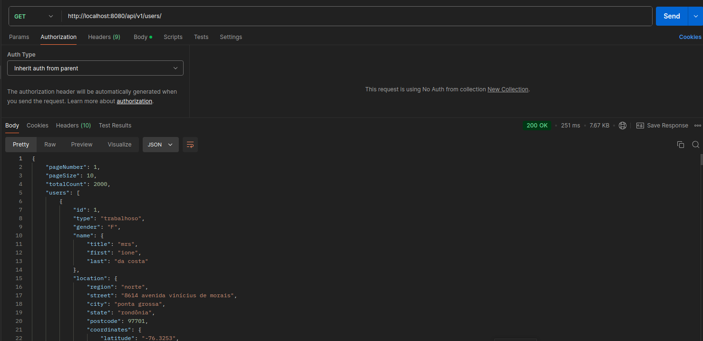
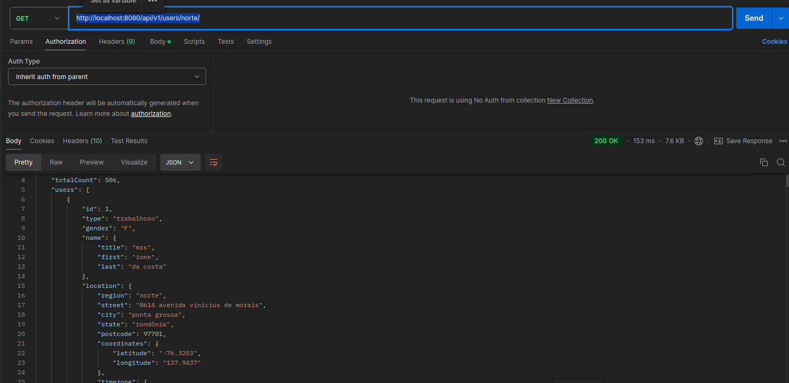
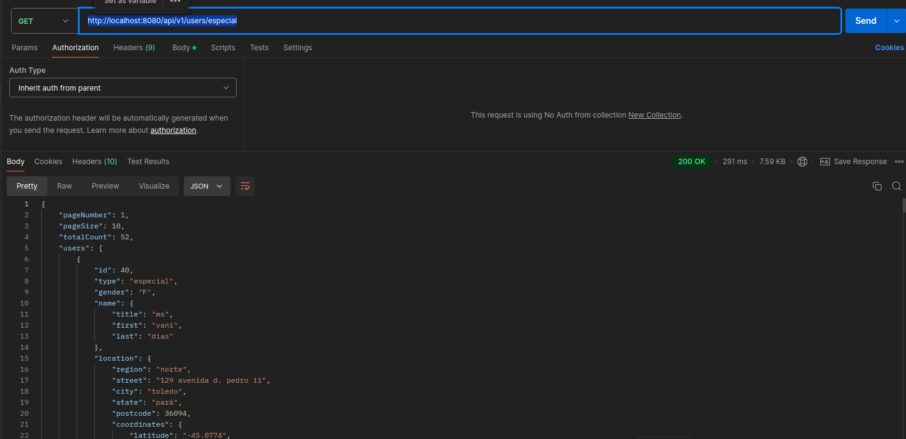
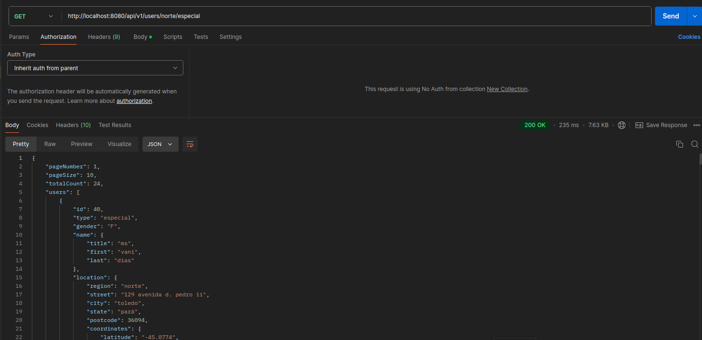
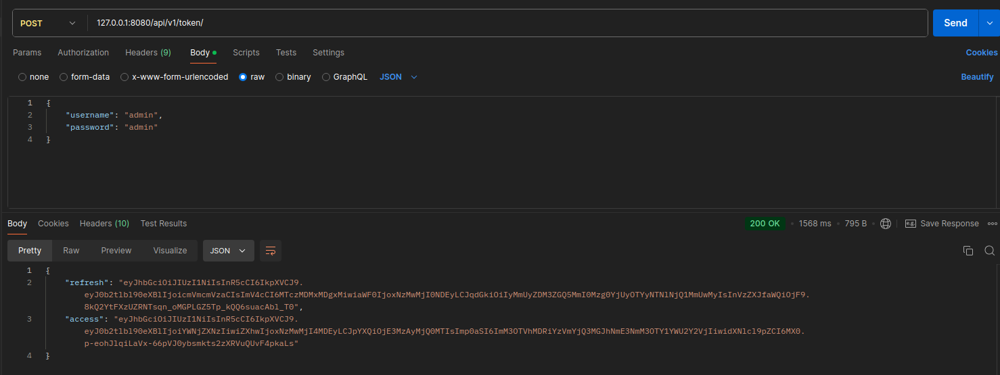
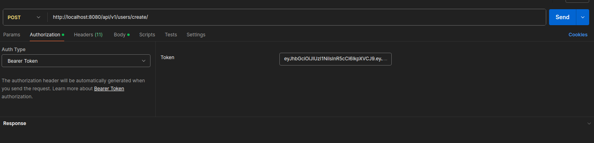
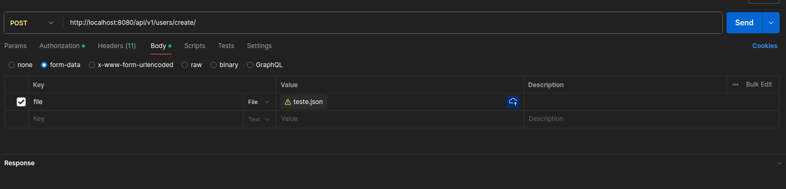
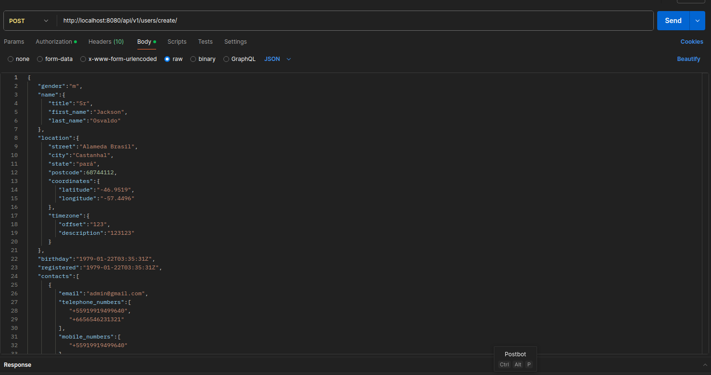

# Teste Case Juntos Somos Mais
## Intruções

### Instale o Docker 

Caso Não tenha instalado, é preciso instalar o Docker.

### Clone este repositório:

```
$ git clone https://github.com/7renan/challenge-juntos.git

```

### Utilize o comando docker para disponibilizar todos os serviços, configurações e dados necessários para a aplicação:


```
docker compose up 
```
ou 

```
docker-compose up

```

### Testes

Foram implementados testes unitários para garantir um bom funcionamento da aplicação.


### Endpoints (Listagem)

#### Busca todos os usuários do banco permitindo alguns filtros:

 - Regiões do Brasil:
     - norte
     - nordeste
     - centro-oeste
     - sudeste
     - sul
 - Tipo:
    - especial
    - normal
    - trabalhoso

#### Busca todos
```
http://localhost:8080/api/v1/users/
``` 


#### Busca todos da região norte
```
http://localhost:8080/api/v1/users/norte/
```


#### Busca todos do tipo especial
```
http://localhost:8080/api/v1/users/especial
```


#### Busca todos da região norte e também do tipo especial
```
http://localhost:8080/api/v1/users/norte/especial
```



### Endpoints (Criação)
#### Para usar os endpoints de criação é necessários usar uma autenticação JWT. Para facilitar os testes, a aplicação cria um super usuário para ser usado.

#### Obter token de autenticação
```
127.0.0.1:8080/api/v1/token/
```


É preciso enviar no corpo da requisição o username (admin) e password(admin) para obter o valor da chave "acceess".

```
{
    "username": "admin",
    "password": "admin"
}
```

#### Enviar registros para serem criados no banco

```
http://localhost:8080/api/v1/users/create/
```
É necessário passar no Cabeçalho o token de autorização obtido anteriormente.


É permitido enviar um arquivo ".json" ou ".csv"


Ou um json no corpo da requisição




